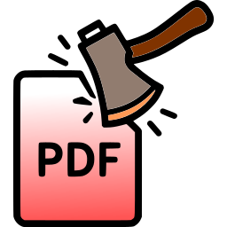
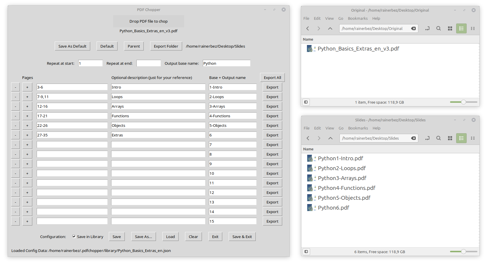

# PDFChopper

PDFChopper is a graphical application designed to split and export pages from PDF files. Its primary purpose is to help you import large PDF documents and divide them into smaller PDFs based on specified page ranges. The application allows you to select specific pages, repeat them at the start or end of the exported files, and save these configurations for future use. Using + and - you can easily modify the page ranges for export when the input/source PDF file is modified.

It is built with Python's Tkinter and tkinterdnd2 for GUI and drag-and-drop support, and uses the `qpdf` utility for PDF manipulation.

## Features

- Drag-and-drop PDF file loading
- Select and export specific page ranges from a PDF
- Repeat pages at the start or end of exported files
- Save and load export PDF chopping configurations as JSON
- Export to custom folders, with quick access to default and parent folders
- Configuration library for reusing previously used export setups

## Requirements (On Linux)

- Python 3
- tkinter (`sudo apt-get install python3-tk`)
- tkinterdnd2 (`pip install tkinterdnd2`)
- qpdf (`sudo apt install qpdf`)

## Installation

To install PDFChopper on a Debian-based system, you can create a Debian package. Here are the steps:

1. Build the DEB file:
   `dpkg-deb --build pdfchopper`
   You can also use the link [pdfchopper.deb](pdfchopper.deb) to download the pre-built DEB package.
2. Install the package:
   `dpkg -i pdfchopper.deb`
3. Run PDFChopper from the application menu or by executing `pdfchopper` in the terminal.
4. Remove the package with:
   `dpkg -r pdfchopper`

## Usage

1. Start the application: `python pdfchopper.py`
2. Drag and drop a PDF file onto the window.
3. Configure export folder, page ranges, output names of chopped PDF files.
4. Export selected pages using the provided buttons.
5. Save PDF chop configurations for future use.

## Configuration

- Configurations are saved as JSON files, either in the PDF's folder or in a dedicated library folder (`~/.pdfchopper/library`).
- Program settings (window position, default export folder, etc.) are saved in `~/.pdfchopper/settings.json`.

## License

This project is open source. See the source code for details.
